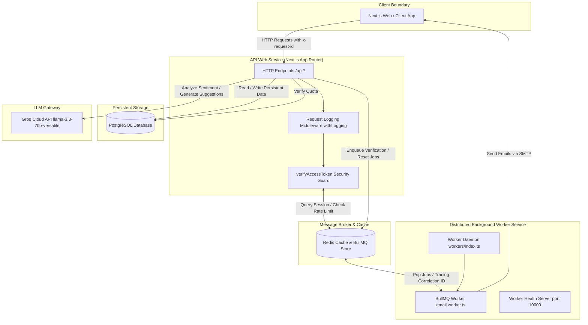

# WhisperLink 🤫 — Core Backend Services & Architecture

WhisperLink is a production-grade, containerized full-stack and background processing backend system. It features a decoupled, multi-service architecture designed to handle secure, anonymous feedback collection and real-time AI-augmented classification.

This repository serves as a showcase of modern, enterprise-grade backend engineering practices: **strict clean/repository-service architecture**, **stateful Redis session management**, **distributed task queue systems (BullMQ + Redis)**, **concurrency-safe atomic database transactions**, **high-availability third-party AI pipelines**, and **end-to-end request-scoped correlation tracing**.

---

## 🏗️ System & Infrastructure Architecture

WhisperLink separates the API endpoint runtime (Next.js serverless/API routes) from background worker processes (BullMQ running as a dedicated Node.js service). The system leverages **Redis** as both a stateful session cache / rate-limiter and a message broker for async task distribution.

### Multi-Service Interaction Flow



---

## 🛠️ Tech Stack & Database Schema

### Backend Stack
* **Language & Runtime:** TypeScript, Node.js (v20+)
* **API Framework:** Next.js 16 (App Router / Serverless API Functions)
* **Database & ORM:** PostgreSQL via Prisma ORM
* **In-Memory Cache & Message Broker:** Redis (ioredis)
* **Distributed Queue Manager:** BullMQ
* **Structured Logger:** Pino & Pino-Pretty
* **Data Validation:** Zod
* **AI Provider Integration:** Groq SDK (Llama 3.3)

### Database Schema Blueprint (`schema.prisma`)
The PostgreSQL database is optimized for heavy write operations (incoming feedback) and quick lookup patterns (inboxes). Indices are strategically configured on lookup keys and timestamp queries:

```prisma
enum Sentiment {
  POSITIVE
  NEGATIVE
  NEUTRAL
}

model User {
  id              String             @id @default(cuid())
  username        String             @unique
  email           String             @unique
  password        String
  isVerified      Boolean            @default(false)
  acceptMessages  Boolean            @default(true)
  createdAt       DateTime           @default(now())
  
  messages        Message[]          @relation("ReceivedMessages")
  aiUsage         AIUsage?
  
  @@index([email])
  @@index([username])
}

model Message {
  id              String             @id @default(cuid())
  receiverId      String
  receiver        User               @relation("ReceivedMessages", fields: [receiverId], references: [id], onDelete: Cascade)
  content         String
  isRead          Boolean            @default(false)
  isArchived      Boolean            @default(false)
  isDeleted       Boolean            @default(false)
  
  // AI Sentiment Fields
  sentiment       Sentiment?
  sentimentScore  Float?             // Float confidence score [0.0 - 1.0]
  createdAt       DateTime           @default(now())

  @@index([receiverId])
  @@index([createdAt])
}

model AIUsage {
  id              String             @id @default(cuid())
  userId          String             @unique
  user            User               @relation(fields: [userId], references: [id], onDelete: Cascade)
  suggestionsUsed Int                @default(0)
  analysisUsed    Int                @default(0)
  lastUsedAt      DateTime?

  @@index([userId])
}
```

---

## 💡 Key Backend Engineering Design Patterns

### 1. Stateful Redis Session Store with Sliding Expirations
Instead of stateless JSON Web Tokens (JWT) which cannot be easily invalidated before their expiration timestamp, WhisperLink bridges JWT method signatures to a stateful **Redis-backed session store**.
* Sessions are generated using high-entropy tokens (`crypto.randomBytes(32)`).
* Session data is cached in Redis with a 7-day Time-To-Live (TTL).
* Verification performs a sliding window refresh, resetting the session's expiration key on every request.
* Logout triggers instant eviction by deleting the session key from Redis.

```typescript
// src/services/session.service.ts
const SESSION_TTL_SECONDS = 7 * 24 * 60 * 60; // 7 Days

export const sessionService = {
  async createSession(data: Omit<SessionData, "createdAt">) {
    const token = crypto.randomBytes(32).toString("hex");
    const sessionData: SessionData = { ...data, createdAt: new Date().toISOString() };

    await redis.set(`session:${token}`, JSON.stringify(sessionData), "EX", SESSION_TTL_SECONDS);
    return { token, session: sessionData, expiresInSeconds: SESSION_TTL_SECONDS };
  },

  async getSession(token: string) {
    const sessionJson = await redis.get(`session:${token}`);
    if (!sessionJson) return null;
    return JSON.parse(sessionJson) as SessionData;
  },

  async refreshSession(token: string) {
    const key = `session:${token}`;
    const exist = await redis.exists(key);
    if (!exist) return false;
    await redis.expire(key, SESSION_TTL_SECONDS); // Extends TTL
    return true;
  }
};
```

---

### 2. Concurrency-Safe Rate Limiting & Lazy Reset Counters
To guard downstream AI resources (Groq APIs) against double-spend exploits and race conditions under parallel spam queries, the database integration incorporates atomic queries and on-demand reset checks.

* **Atomic Database Increments:** Enforces quota updates inside transactional updates (`increment: 1`), generating SQL-level updates (`UPDATE ... SET count = count + 1`) that lock the database row, preventing read-modify-write race conditions.
* **Lazy Evaluation Reset:** Daily counters reset dynamically on the *first user interaction of a new calendar day*. This eliminates the operational overhead, timezone errors, and database lock contention associated with bulk midnight cron jobs.

```typescript
// src/repositories/ai-usage.repository.ts
export const aiUsageRepository = {
  async canUseSuggestions(userId: string): Promise<{ allowed: boolean; remaining: number }> {
    const usage = await this.findOrCreate(userId);
    const shouldReset = this.isDifferentDay(usage.lastUsedAt);

    if (shouldReset) {
      // Inline lazy reset on first request of the day
      await prisma.aIUsage.update({
        where: { userId },
        data: { suggestionsUsed: 0, analysisUsed: 0, lastUsedAt: new Date() },
      });
      return { allowed: true, remaining: DAILY_SUGGESTION_LIMIT };
    }

    const remaining = DAILY_SUGGESTION_LIMIT - usage.suggestionsUsed;
    return { allowed: remaining > 0, remaining: Math.max(0, remaining) };
  },

  async incrementSuggestions(userId: string) {
    // Transactional write ensures logs & counts update atomically
    return prisma.$transaction([
      prisma.aIUsage.update({
        where: { userId },
        data: { suggestionsUsed: { increment: 1 }, lastUsedAt: new Date() },
      }),
      prisma.aIUsageLog.create({
        data: { userId, feature: "suggestions" },
      }),
    ]);
  }
};
```

---

### 3. Distributed Background Queue Processing (BullMQ)
Heavy operations, such as generating OTP verification codes and dispatching SMTP transactional emails, are offloaded from the main HTTP thread into **BullMQ** running on Redis.

* **Decoupled Workers:** Background workers run as a separate runtime daemon (`workers/index.ts`), isolated from the API process.
* **Resilient Job Options:** Configured with 3-attempt limits, exponential backoff policies, and automated cleanup rules.
* **Standalone Health Probes:** Includes an independent HTTP server listening on port 10000 in the worker process to serve health indicators (`/health`) to Kubernetes or container orchestrators.

```typescript
// src/lib/queues/email.queue.ts
export const emailQueue = new Queue<EmailJob>("email-queue", {
  connection: { url: process.env.REDIS_URL },
  defaultJobOptions: {
    attempts: 3,
    backoff: { type: "exponential", delay: 5000 },
    removeOnComplete: { age: 3600, count: 1000 },
    removeOnFail: { age: 86400, count: 1000 }
  }
});

// workers/email.worker.ts
export const emailWorker = new Worker<EmailJob>("email-queue", async (job) => {
  const { type, payload } = job.data;
  switch (type) {
    case "SEND_OTP_EMAIL":
      await sendVerificationEmail(payload.to, payload.otp);
      break;
    case "SEND_PASSWORD_RESET_EMAIL":
      await sendPasswordResetEmail(payload.to, payload.token);
      break;
  }
}, {
  connection: { url: process.env.REDIS_URL },
  concurrency: 5 // Parallel execution threads per container
});
```

---

### 4. Structured Logging & End-to-End Tracing (Correlation IDs)
WhisperLink runs **Pino** for structured JSON logging. All logs carry standardized context fields (`service`, `environment`, `level`).

* **Request Correlation (`requestId`):** Generated in the API gateway wrapper (`withLogging`) and set as a response header.
* **Distributed Tracing:** The `requestId` is propagated from the HTTP route context into the PostgreSQL transaction and enqueued into the BullMQ job payload. When the worker parses the job, it carries the same correlation ID into the background worker logs. This allows tracing the complete lifecycle of a user transaction (HTTP API ➡️ Queue ➡️ Worker execution) with a single query.

```typescript
// Correlation propagation flow:
Incoming HTTP Request 
  ↳ route-handler.ts -> generate UUID / extract 'x-request-id'
  ↳ logger.info({ event: "request_started", requestId })
  ↳ enqueueOtpEmail(email, otp, requestId)
      ↳ Job Payload: { type: "SEND_OTP_EMAIL", payload: { ..., requestId } }
          ↳ email.worker.ts -> processEmailJob()
              ↳ logger.info({ event: "email_job_started", requestId, jobId })
```

---

### 5. High-Availability LLM Pipeline (Groq + Llama 3.3)
The AI engine integrates third-party LLMs with strict schema validation and error-tolerant fallback policies:
* **JSON Schema Parsing:** Raw outputs from the LLM are passed to a sanitizer that strips Markdown blocks and parses them against rigid, type-safe Zod schemas.
* **Low-Temperature Determinism:** Models execute at `temperature = 0.1` to force probability constraints, preventing divergent classification ratings on identical messages.
* **Graceful Degradation:** If Groq's cloud drops, the service catches the exception and resolves fallback arrays or neutral sentiments to ensure zero user-facing service interruptions.

---

### 6. Deep Diagnostic Health Check System
The `/api/health` HTTP endpoint performs a **deep diagnostic check** of the backend infrastructure by querying dependencies in parallel and measuring their response times:
1. **PostgreSQL Check:** Executes a raw query `SELECT 1` via the Prisma Client.
2. **Redis Check:** Sends a ping command and expects a `PONG` response.
3. **Queue Check:** Queries BullMQ for queued jobs count.

If any check fails, it responds with `503 Service Unavailable`, reporting exactly which resource went offline, making it compatible with automated load-balancer and monitoring probes.

```json
{
  "status": "healthy",
  "timestamp": "2026-07-01T16:15:30.000Z",
  "totalTimeMs": 14,
  "database": { "status": "connected", "responseTimeMs": 4 },
  "redis": { "status": "connected", "responseTimeMs": 2 },
  "queue": {
    "status": "connected",
    "responseTimeMs": 8,
    "jobCounts": { "waiting": 0, "active": 0, "completed": 24, "failed": 0 }
  },
  "environment": "production"
}
```

---

## 📂 Core Directory Map (Backend Focus)

```text
my-app/
├── src/
│   ├── app/
│   │   └── api/                # REST Controllers (Request / Response Boundaries)
│   │       ├── ai/             # AI Endpoints (Suggestions / Usage Counters)
│   │       ├── auth/           # Session management & verification OTP flows
│   │       ├── health/         # Deep System Health Checks
│   │       └── messages/       # Feedback storage, read states & inbox retrieval
│   ├── lib/                    # Core System Infrastructure
│   │   ├── ai/                 # LLM Interfaces, Groq provider, JSON parsers
│   │   ├── auth/               # Session encryption tokens and hashing (Bcrypt)
│   │   ├── prisma/             # Prisma client instance configuration & Schema
│   │   └── queues/             # BullMQ Queue dispatch controllers
│   ├── repositories/           # Data Access Layer (Direct SQL database calls)
│   │   ├── ai-usage.repository.ts
│   │   ├── message.repository.ts
│   │   └── user.repository.ts
│   ├── services/               # Core Domain Logic / Business Services Orchestrator
│   │   ├── ai.service.ts
│   │   ├── otp.service.ts
│   │   └── email.service.ts
│   └── schemas/                # System-wide Zod validation schemas
├── workers/                    # BullMQ Daemon Service (Background Jobs)
│   ├── index.ts                # Daemon entrypoint
│   ├── email.worker.ts         # Task consumers & SMTP dispatch logic
│   └── health.server.ts        # Dedicated HTTP status health check (Port 10000)
```

---

## 🔌 API Documentation (Backend Spec)

All API endpoints are validated on input using Zod schemas and require HTTP-Only cookie authentication where noted.

### Authentication Endpoints

#### `POST /api/auth/register`
Creates a user profile. Injects default rate limit trackers.
* **Payload (JSON):**
  ```json
  {
    "username": "coder123",
    "email": "coder@example.com",
    "password": "SecurePassword123"
  }
  ```
* **Response (201 Created):**
  ```json
  { "success": true, "message": "User registered successfully" }
  ```

#### `POST /api/auth/login`
Validates credentials and yields an HTTP-Only session cookie.
* **Payload (JSON):**
  ```json
  { "email": "coder@example.com", "password": "SecurePassword123" }
  ```
* **Response (200 OK):** Sets Cookie `session=<token>; HttpOnly; SameSite=Lax; Path=/`

#### `POST /api/auth/otp/request`
Generates a random 6-digit OTP, stores its SHA-256 hash in Redis, and dispatches an async verification email job to the queue.
* **Payload (JSON):**
  ```json
  { "email": "coder@example.com" }
  ```
* **Response (200 OK):**
  ```json
  { "success": true, "message": "OTP sent successfully" }
  ```

---

### Feedback & AI Endpoints

#### `POST /api/messages/send`
Allows anonymous users to write feedback. Triggers the sentiment evaluation pipeline.
* **Payload (JSON):**
  ```json
  {
    "receiverUsername": "coder123",
    "content": "Your API architecture patterns are exceptional!"
  }
  ```
* **Response (200 OK):**
  ```json
  {
    "success": true,
    "message": "Message sent successfully",
    "sentiment": "POSITIVE"
  }
  ```

#### `POST /api/ai/suggestions`
Generates suggested conversation starter statements using the AI engine. Fully decoupled fallback safety handles rate limits and API failures.
* **Payload (JSON):**
  ```json
  { "username": "coder123" }
  ```
* **Response (200 OK):**
  ```json
  {
    "success": true,
    "suggestions": [
      "What core architectural patterns do you prefer for high-concurrency systems?",
      "How do you manage database index optimization?",
      "What is your strategy for processing backlogs in worker pools?"
    ]
  }
  ```

---

## ⚙️ Environment Configuration

Ensure you create a `.env` file in the root workspace directory before starting:

```env
# Database Context
DATABASE_URL="postgresql://<user>:<password>@localhost:5432/whisperlink?schema=public"

# Redis Cache & Message Broker Endpoint
REDIS_URL="redis://localhost:6379"

# Token Secret for Cryptographic Session Store
AUTH_SECRET="generate-a-high-entropy-64-character-string"

# Groq Cloud API Gateway Authentication
GROQ_API_KEY="gsk_your_groq_api_key"

# Email Worker (SMTP Provider Configuration)
SMTP_HOST="smtp.mailtrap.io"
SMTP_PORT=2525
SMTP_USER="your_smtp_username"
SMTP_PASSWORD="your_smtp_password"
EMAIL_FROM="no-reply@whisperlink.com"

# Public Context Endpoint URL
NEXT_PUBLIC_APP_URL="http://localhost:3000"
```

---

## 🚀 Orchestration & Local Setup

### Running with Docker Compose (Recommended)
WhisperLink includes a pre-configured multi-container orchestration system to spawn all services, database connections, and caches in isolated networks.

```bash
# Build images and start Postgres, Redis, the Web API, and the BullMQ Queue Worker
docker compose up -d --build
```

### Manual Setup

1. **Install Dependencies:**
   ```bash
   npm install
   ```
2. **Synchronize Schema & Client:**
   ```bash
   npx prisma db push
   npx prisma generate
   ```
3. **Execute the API Server:**
   ```bash
   npm run dev
   ```
4. **Boot the Background Queue Worker:**
   ```bash
   # Starts the tsx daemon runtime watching worker/index.ts
   npm run worker:dev
   ```

### Code Verification Checks
```bash
# Run ESLint validation rules
npm run lint

# Verify TypeScript type-safety and compile the Next.js API bundle
npm run build
```
