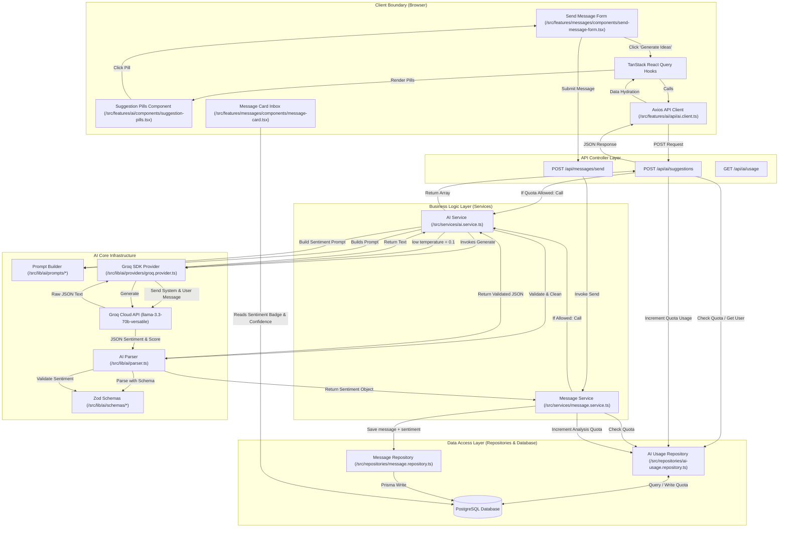

# WhisperLink AI Integration Architecture

WhisperLink integrates state-of-the-art Large Language Models (LLMs) to deliver intelligent user experiences:
1. **AI Message Suggestions:** Generates context-appropriate, human-like prompts on public profiles to inspire visitors.
2. **AI Sentiment Analyzer:** Classifies incoming anonymous messages into sentiment categories with confidence ratings, providing users with immediate emotional indicators in their dashboard inbox.

This system is engineered for **resiliency (100% profile uptime via graceful fallbacks)**, **economic feasibility (strict database-level token bucket rate-limiting)**, **high concurrency safety (atomic transactions preventing race conditions)**, and **rigid schema enforcement (safe parsing with type-safe Zod validation)**.

---

## 1. High-Level AI Architecture Flow

The following diagram illustrates the unidirectional data flow across the client, backend controller, service, external AI provider, and database boundaries.



---

## 2. Directory & File Roles

The system is split into decoupled directories separating infrastructure, prompt templates, structured output validation, database coordination, and frontend components:

### A. AI Infrastructure (`/src/lib/ai/`)
* **[ai-provider.interface.ts](file:///d:/WhisperLink/my-app/src/lib/ai/providers/ai-provider.interface.ts):**
  Defines the model-agnostic contract `AIProvider` and `AIProviderOptions`. This ensures we can swap LLM providers (e.g., Groq, OpenAI, Anthropic) without rewriting downstream business services.
* **[groq.provider.ts](file:///d:/WhisperLink/my-app/src/lib/ai/providers/groq.provider.ts):**
  A concrete implementation of `AIProvider` wrapping the `groq-sdk`. It targets the high-throughput `llama-3.3-70b-versatile` model. It handles API authentication, request timeout configuration, fallback parameters (like temperature), and configures JSON Mode response formats.
* **[parser.ts](file:///d:/WhisperLink/my-app/src/lib/ai/parser.ts):**
  Sanitizes and normalizes raw output strings returned by LLMs. It removes markdown formatting wrappers (such as ` ```json ... ``` `) and applies Zod validation schemas. It throws a standardized `ApiError` if the payload is malformed or invalid.

### B. Prompt Engineering (`/src/lib/ai/prompts/`)
* **[suggestions.prompt.ts](file:///d:/WhisperLink/my-app/src/lib/ai/prompts/suggestions.prompt.ts):**
  Constructs the instructions asking the LLM to output exactly 5 human-like, short, single-sentence messages formatted in JSON. It dynamically customizes ideas based on the target user's username, requesting a strict distribution of message categories (Appreciation, Constructive feedback, Compliment, Question, Encouragement).
* **[sentiment.prompt.ts](file:///d:/WhisperLink/my-app/src/lib/ai/prompts/sentiment.prompt.ts):**
  Instructs the LLM to categorize content as `POSITIVE`, `NEGATIVE`, or `NEUTRAL` and output a confidence value between `0` and `1`.
* **[replies.prompt.ts](file:///d:/WhisperLink/my-app/src/lib/ai/prompts/replies.prompt.ts):**
  *(Prepared utility)* Instructs the LLM to generate exactly 3 replies (casual, witty, thoughtful) to a received anonymous message.

### C. Output Schemas (`/src/lib/ai/schemas/` & `/src/schemas/`)
* **[suggestions.schema.ts](file:///d:/WhisperLink/my-app/src/lib/ai/schemas/suggestions.schema.ts):**
  Zod schema verifying that the model outputs a JSON object containing an array of exactly 5 strings.
* **[sentiment.schema.ts](file:///d:/WhisperLink/my-app/src/lib/ai/schemas/sentiment.schema.ts):**
  Zod schema verifying the sentiment classification enum and numerical confidence score range.
* **[replies.schema.ts](file:///d:/WhisperLink/my-app/src/lib/ai/schemas/replies.schema.ts):**
  Zod schema validating that the replies contain casual, witty, and thoughtful strings.
* **[ai.schema.ts](file:///d:/WhisperLink/my-app/src/schemas/ai.schema.ts):**
  Provides types and schemas shared with frontend client callers.

### D. Business Logic Services (`/src/services/`)
* **[ai.service.ts](file:///d:/WhisperLink/my-app/src/services/ai.service.ts):**
  Orchestrates prompt compilation, provider execution, and parser validation. Crucially, it provides **graceful fallbacks** in its catch blocks. If the external AI API is down, it intercepts the error and returns high-quality, pre-defined static fallback suggestions/replies rather than breaking the application flow.
* **[message.service.ts](file:///d:/WhisperLink/my-app/src/services/message.service.ts):**
  Integrates sentiment analysis into the message sending pipeline. When an anonymous message is sent, it performs rate-limiting authorization, executes the sentiment service, logs usage, and commits the sentiment details alongside the message text.

### E. Rate Limiting Layer (`/src/repositories/`)
* **[ai-usage.repository.ts](file:///d:/WhisperLink/my-app/src/repositories/ai-usage.repository.ts):**
  Encapsulates the Token Bucket rate-limiting logic directly inside PostgreSQL via Prisma. (See detailed section below).
* **[ai-usage-log.repository.ts](file:///d:/WhisperLink/my-app/src/repositories/ai-usage-log.repository.ts):**
  Creates transactional auditing logs in `AIUsageLog` for security and volume tracking.
* **[message.repository.ts](file:///d:/WhisperLink/my-app/src/repositories/message.repository.ts):**
  Handles direct writing and retrieving of message models including database-level `sentiment` and `sentimentScore` columns.

### F. API Routes (`/src/app/api/`)
* **[suggestions/route.ts](file:///d:/WhisperLink/my-app/src/app/api/ai/suggestions/route.ts):**
  Public endpoint `/api/ai/suggestions`. Checks rate limit, fetches AI suggestions or triggers the fallback lists, and logs usage.
* **[usage/route.ts](file:///d:/WhisperLink/my-app/src/app/api/ai/usage/route.ts):**
  Protected endpoint `/api/ai/usage` enabling users to query remaining limits.

### G. Client Components & Hooks (`/src/features/`)
* **[ai.client.ts](file:///d:/WhisperLink/my-app/src/features/ai/api/ai.client.ts):**
  Axios connector hook.
* **[use-generate-suggestions.ts](file:///d:/WhisperLink/my-app/src/features/ai/hooks/use-generate-suggestions.ts):**
  TanStack Query mutation wrapper with error notifications.
* **[suggestion-pills.tsx](file:///d:/WhisperLink/my-app/src/features/ai/components/suggestion-pills.tsx):**
  A component with loading skeleton state animation rendering message suggestions.
* **[send-message-form.tsx](file:///d:/WhisperLink/my-app/src/features/messages/components/send-message-form.tsx):**
  Orchestrates the public submission text box and links suggestion pill selection directly into the text state.
* **[message-card.tsx](file:///d:/WhisperLink/my-app/src/features/messages/components/message-card.tsx):**
  Processes `sentiment` and `sentimentScore` to display color-coded, badge-wrapped, relative emotional indicators in the dashboard.

---

## 3. Database Schema Blueprint (`schema.prisma`)

```prisma
enum Sentiment {
  POSITIVE
  NEGATIVE
  NEUTRAL
}

model Message {
  id              String      @id @default(cuid())
  receiverId      String
  receiver        User        @relation("ReceivedMessages", fields: [receiverId], references: [id], onDelete: Cascade)
  senderId        String?
  sender          User?       @relation("SentMessages", fields: [senderId], references: [id], onDelete: SetNull)
  content         String
  isRead          Boolean     @default(false)
  isArchived      Boolean     @default(false)
  isDeleted       Boolean     @default(false)
  
  // AI Sentiment Fields
  sentiment       Sentiment?
  sentimentScore  Float?      // Floating-point confidence score [0.0 - 1.0]

  createdAt       DateTime    @default(now())
  updatedAt       DateTime    @updatedAt

  @@index([receiverId])
  @@index([createdAt])
}

model AIUsage {
  id              String    @id @default(cuid())
  userId          String    @unique
  user            User      @relation(fields: [userId], references: [id], onDelete: Cascade)
  
  suggestionsUsed Int       @default(0)
  analysisUsed    Int       @default(0)
  lastUsedAt      DateTime?

  createdAt       DateTime  @default(now())
  updatedAt       DateTime  @updatedAt

  @@index([userId])
}

model AIUsageLog {
  id        String   @id @default(cuid())
  userId    String
  user      User     @relation(fields: [userId], references: [id], onDelete: Cascade)
  
  feature   String   // "suggestions" | "sentiment-analysis"
  createdAt DateTime @default(now())

  @@index([userId])
  @@index([feature])
  @@index([createdAt])
}
```

---

## 4. Key Engineering Design Patterns

### 1. The Token Bucket & Lazy Evaluation Rate Limiting Pattern
To protect our Groq API from billing exhaustion and denial-of-service spam, we enforce daily quota ceilings:
* **Suggestions Limit:** 50 requests/day per user profile.
* **Sentiment Analysis Limit:** 10 requests/day per inbox.

#### Resilient Engineering Decisions:
1. **Lazy Initialization:** We do not pre-allocate `AIUsage` rows when users register. Instead, the row is instantiated inside `findOrCreate()` on their **first use** of an AI feature. This saves storage and minimizes database write overhead for inactive accounts.
2. **Lazy Reset Counter:** We do not run cron jobs at midnight. Cron jobs scale poorly, fail silently, present timezone matching challenges, and cause massive database lock contention at midnight. Instead, we use **lazy evaluation on the next incoming request**:
   * We compare `lastUsedAt` with the current date.
   * If they fall on different calendar days, we reset the counters to `0` inline inside the transaction and grant access immediately.
3. **Atomic Increments (Concurrency Safety):**
   To prevent race conditions where multiple rapid requests arrive simultaneously, we use SQL-level atomic increments:
   ```typescript
   prisma.aIUsage.update({
     where: { userId },
     data: { suggestionsUsed: { increment: 1 } }
   });
   ```
   This compiles into:
   ```sql
   UPDATE "AIUsage" SET "suggestionsUsed" = "suggestionsUsed" + 1 WHERE "userId" = $1;
   ```
   This database lock ensures accuracy, avoiding the classic "read-modify-write" race condition (where two requests read `5`, both update to `6`, when the actual value should have been `7`).

### 2. High-Availability Fallback Mechanism
If our API key expires, Groq's cloud drops, or a network request timeouts, the user experience must not fail.
* **Suggestion Fallbacks:** If `generateMessageSuggestions` fails, the route intercepts the error, falls back to a curated array of general interest questions, and sets the source response header to `"fallback"`.
* **Rate-Limit Exhaustion:** If a user exhausts their daily quota of suggestions, rather than displaying a jarring `429 Too Many Requests` error to public visitors, we return the fallback suggestions under a standard `200 OK`. This keeps the profile fully interactive for visitors while preserving the user's AI API credits.
* **Sentiment Fallbacks:** If sentiment analysis fails, it defaults to `NEUTRAL` with a confidence score of `0.5`, ensuring messages are still saved and readable.

### 3. Low-Temperature Sentiment Consistency
For sentiment analysis, we require high predictability and deterministic categorization. We override the default temperature parameters of the provider to **`0.1`**:
```typescript
const rawResponse = await groqProvider.generate(prompt, {
  temperature: 0.1,
  responseSchema: sentimentResponseSchema,
});
```
This forces the model to choose highly probable tokens, ensuring that the same message submitted twice does not fluctuate between different classifications or confidence values.

---

## 5. End-to-End Walkthrough of the AI Sentiment Analysis Loop

1. **Submission:** A visitor types *"I really love your work!"* and clicks **Send anonymously**.
2. **Endpoint Validation:** The endpoint `/api/messages/send` validates the input string length and structure using `SendMessageSchema`.
3. **Quota Check:** `messageService` queries `aiUsageRepository.canUseAnalysis(receiver.id)`. It checks if `lastUsedAt` is on a different day to reset the counters, and checks if `analysisUsed` is less than `10`.
4. **LLM Invocation:** If the quota check returns `allowed: true`, the service formats the sentiment prompt template, and sends a POST request via `groqProvider` to Groq using a temperature of `0.1` and requesting structured JSON mode.
5. **LLM Output:** Llama 3.3 returns a string representation of the JSON:
   ```json
   {
     "sentiment": "POSITIVE",
     "score": 0.95
   }
   ```
6. **Parsing & Schema Validation:** `parser.ts` strips any potential markdown indicators, runs JSON parsing, and validates that it contains the keys `sentiment` and `score` using `sentimentResponseSchema`.
7. **Commit & Log:**
   * It increments the receiver's database counter `analysisUsed` and appends an entry to the `AIUsageLog` inside a single atomic transaction block.
   * It writes the final values (`POSITIVE`, `0.95`) to the `sentiment` and `sentimentScore` columns in the `Message` table.
8. **Visualization:** When the receiver logs in, their client dashboard pulls the message payload. The React component `MessageCard` checks if `sentiment` is present and renders a green badge containing a **Smile** icon along with *"Confidence: 95%"*.
