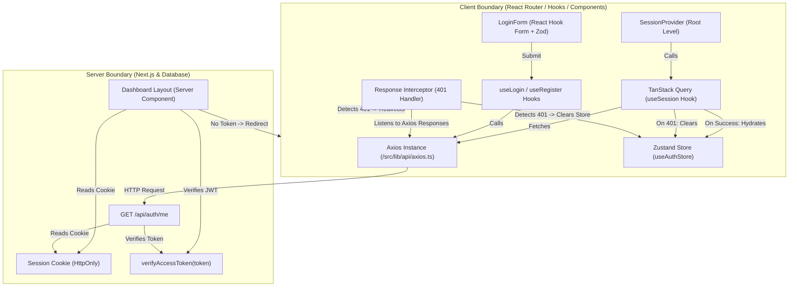

# WhisperLink Frontend Authentication Architecture

As a Senior Frontend/Software Engineer, designing a secure, performant, and maintainable authentication system requires clear separation of concerns, secure token handling, and robust state management. 

WhisperLink implements a state-of-the-art authentication model using **Next.js App Router (Server-Side Redirects)**, **Axios Interceptors (Client-Side Session Expiry & Token Eviction)**, **Zustand (Client Global Auth State & Session Persistence)**, and **TanStack React Query (Server-State Synchronization & Mutation Management)**.

This document details how authorization flows end-to-end from our API boundaries to our UI components and pages.

---

## 1. Architectural Design Overview

The architecture enforces a strict **Unidirectional Data Flow** and a separation between **Server State** (e.g., "is the user currently authenticated according to the database?") and **Client UI State** (e.g., "what user data is cached in memory for UI presentation?").

Below is the conceptual architecture of the authentication flow:



---

## 2. Deep Dive Into Architectural Layers

We break the system down into five logical layers:
1. **Server-Side Protection Layer** (Static/Dynamic Access Verification)
2. **State & Synchronization Layer** (Client-side global state vs Server state)
3. **API & Interceptor Layer** (Network boundary, cookie config, dynamic imports)
4. **Form & Validation Layer** (Schema enforcement and user interaction)
5. **Error & Normalization Layer** (Error extraction and mapping)

---

### Layer 1: Server-Side Protection (Routing & Layouts)

Server-side protection ensures that users cannot access protected views like the dashboard without a valid session, bypassing any client-side JavaScript execution lag or state load delays. This prevents "layout flashing" (unauthenticated state flashing before redirecting).

#### 📄 [src/app/dashboard/layout.tsx](file:///d:/WhisperLink/my-app/src/app/dashboard/layout.tsx)
The dashboard layout is an **Asynchronous Server Component**. Before any dashboard content renders:
1. It reads the session cookie using `getSessionCookie()` from [src/lib/auth/cookies.ts](file:///d:/WhisperLink/my-app/src/lib/auth/cookies.ts).
2. If the cookie is absent, it immediately triggers a server-side `redirect("/login")`.
3. If the cookie is present, it verifies the token on the server using `verifyAccessToken(token)` from [src/lib/auth/jwt.ts](file:///d:/WhisperLink/my-app/src/lib/auth/jwt.ts).
4. On verification success, it supplies the user details directly to the layout shell ([DashboardLayout](file:///d:/WhisperLink/my-app/src/components/ui/layout/DashboardLayout.tsx)).

```typescript
export default async function DashboardGroupLayout({ children }: { children: React.ReactNode }) {
  const token = await getSessionCookie();
  if (!token) {
    redirect("/login");
  }
  const user = await verifyAccessToken(token);

  return (
    <DashboardLayout user={{ username: user.username, email: user.email }}>
      {children}
    </DashboardLayout>
  );
}
```

* **Why this is secure**: Since the session cookie is configured as `HttpOnly`, it is inaccessible to client-side scripts, completely eliminating access token theft via Cross-Site Scripting (XSS).
* **Performance benefit**: Redirection happens at the edge/server before transmitting HTML, minimizing client processing.

---

### Layer 2: Client-Side Global State & Server Synchronization

While the server protects routes, client components (e.g. Navigation bars, user settings, conditional headers) need access to the current authenticated user's details without making constant database hits.

We split this state into two parts:
1. **Zustand Store** (for synchronous UI representation and client caching).
2. **React Query** (for managing the asynchronous lifecycle of fetching the current session from `/api/auth/me`).

#### 📄 [src/features/auth/store/auth.store.ts](file:///d:/WhisperLink/my-app/src/features/auth/store/auth.store.ts)
The global store holds the authenticated `user` object and a `status` indicator (`loading` | `authenticated` | `unauthenticated`).

```typescript
export const useAuthStore = create<AuthState>()(
  persist(
    (set) => ({
      user: null,
      status: "loading",
      setUser: (user) => set({ user }),
      setStatus: (status) => set({ status }),
      hydrate: (user) => set({ user, status: "authenticated" }),
      logout: () => set({ user: null, status: "unauthenticated" }),
    }),
    {
      name: "whisperlink-auth",
      storage: createJSONStorage(() => sessionStorage),
      partialize: (state) => ({ user: state.user, status: state.status }),
    }
  )
);
```

* **Engineering Rationale**: 
  - **sessionStorage over localStorage**: We use `sessionStorage` because authorization sessions are tab-bound. If a user logs out in one tab or closes the browser window, it's safer to discard or restrict the persisted store state than saving it permanently in `localStorage`.
  - **partialize**: We isolate and persist only the `user` and `status` fields to prevent serialization errors of functions (`setUser`, `logout`).

#### 📄 [src/features/auth/hooks/use-auth-store.ts](file:///d:/WhisperLink/my-app/src/features/auth/hooks/use-auth-store.ts)
Instead of importing the full Zustand store, components import specific selectors (`useCurrentUser`, `useAuthStatus`).

```typescript
export function useCurrentUser() {
  return useAuthStore((s) => s.user);
}
```
* **Why this is critical**: Selecting specific parts of the store prevents unnecessary component re-renders. If `status` changes but `user` remains identical, components using `useCurrentUser()` will not trigger a re-render.

#### 📄 [src/features/auth/hooks/use-session.ts](file:///d:/WhisperLink/my-app/src/features/auth/hooks/use-session.ts)
This hook acts as the **bridge** between the API and Zustand. It utilizes React Query's `useQuery` to fetch the current user profile from `/api/auth/me`, then fires a `useEffect` to synchronize Zustand:

```typescript
export function useSession() {
  const hydrate = useAuthStore((s) => s.hydrate);
  const logout = useAuthStore((s) => s.logout);

  const query = useQuery({
    queryKey: ["auth", "session"],
    queryFn: async () => {
      const res = await authClient.me();
      return res.data.data;
    },
    retry: false,
    staleTime: 5 * 60 * 1000, // 5 minutes cache validity
  });

  useEffect(() => {
    if (query.data) {
      hydrate(query.data);
    } else if (query.isError) {
      logout();
    }
  }, [query.data, query.isError, hydrate, logout]);

  return query;
}
```
* **Why this is used**: We set `retry: false` because if a token is missing or expired, retrying 3 times will only delay rendering and spam the auth backend. We set `staleTime: 5 minutes` to avoid triggering a `/me` call on every component mount.

#### 📄 [src/components/providers/session-provider.tsx](file:///d:/WhisperLink/my-app/src/components/providers/session-provider.tsx)
Mounted at the root layout ([src/app/layout.tsx](file:///d:/WhisperLink/my-app/src/app/layout.tsx)) inside `QueryProvider`, this "silent provider" executes `useSession()` exactly once on initial application load to hydrate the global auth state.

---

### Layer 3: API Transportation & The Interceptor Pattern

Our network interactions reside in a dedicated client wrapper. All HTTP calls inherit options configured on a centralized Axios instance.

#### 📄 [src/lib/api/axios.ts](file:///d:/WhisperLink/my-app/src/lib/api/axios.ts)
The global Axios instance configures the `/api` prefix, sends cookies credentials (`withCredentials: true`), and sets up a response interceptor to intercept `401 Unauthorized` responses.

```typescript
api.interceptors.response.use(
  (response) => response,
  (error) => {
    if (
      error.response?.status === 401 &&
      typeof window !== "undefined" &&
      !window.location.pathname.startsWith("/login")
    ) {
      // Dynamic import to avoid static import circular dependencies!
      import("@/features/auth/store/auth.store").then(({ useAuthStore }) => {
        useAuthStore.getState().logout();
      });

      window.location.href = "/login";
    }

    return Promise.reject(error);
  }
);
```

#### 💡 Senior Engineer Highlight: Dynamic Imports in Interceptors
If we statically import `useAuthStore` at the top of [src/lib/api/axios.ts](file:///d:/WhisperLink/my-app/src/lib/api/axios.ts), we create a **circular dependency cycle**:
* `axios.ts` imports `auth.store.ts`
* `auth.store.ts` utilizes actions or hooks that might trigger requests using `auth.client.ts`
* `auth.client.ts` imports `axios.ts` to access the `api` instance.

By deferring the store loading inside the error block via `import(...)`, we break this static analysis chain. The store is only imported and evaluated **on demand** when a 401 error is actually thrown.

---

### Layer 4: Form Validations & Mutations (UI to API Connection)

Each page in the `(auth)` group renders a specialized form component which manages input state, client-side validation, and server mutations.

#### 📄 [src/features/auth/components/login-form.tsx](file:///d:/WhisperLink/my-app/src/features/auth/components/login-form.tsx)
The login form utilizes `react-hook-form` bound with a Zod schema resolver using `LoginSchema` from [src/schemas/auth.schema.ts](file:///d:/WhisperLink/my-app/src/schemas/auth.schema.ts).

```typescript
export function LoginForm() {
  const loginMutation = useLogin();
  
  const { register, handleSubmit, formState: { errors } } = useForm<LoginInput>({
    resolver: zodResolver(LoginSchema),
    defaultValues: { email: "", password: "" }
  });

  return (
    <form onSubmit={handleSubmit((data) => loginMutation.mutate(data))}>
      {/* Inputs binded using {...register("fieldName")} */}
    </form>
  );
}
```

#### 📄 [src/features/auth/hooks/use-login.ts](file:///d:/WhisperLink/my-app/src/features/auth/hooks/use-login.ts)
This hook wraps the TanStack Mutation framework. It coordinates the registration/login side effects:

```typescript
export function useLogin() {
  const router = useRouter();
  const searchParams = useSearchParams();
  const callbackUrl = searchParams.get("callbackUrl") || "/dashboard";
  const hydrate = useAuthStore((s) => s.hydrate);

  return useMutation({
    mutationFn: (data: LoginInput) => authClient.login(data),
    onSuccess: (res) => {
      hydrate(res.data.data.user);
      toast.success("Welcome back.");
      router.replace(callbackUrl);
      router.refresh();
    },
    onError: (error, variables) => {
      const message = getAuthErrorMessage(error);
      
      if (message === "User not verified") {
        toast.info("Please verify your email to continue.");
        router.push(`/verify-email?email=${encodeURIComponent(variables.email)}`);
      } else {
        toast.error(message);
      }
    },
  });
}
```
* **Advanced Flow Redirection**: Notice how the login error boundary checks for `"User not verified"`. If the API signals that the credentials are correct but the user hasn't confirmed their verification OTP, `useLogin` catches this, displays an informational toast, and forces a router redirect to the email verification page (`/verify-email?email=...`), passing the email in the query parameters to prepopulate the OTP verification form.

---

### Layer 5: Unified Error Extraction

Error structures coming back from network requests can vary (e.g., Zod validation schema errors on the server, network dropout, raw HTTP error objects, database exceptions).

#### 📄 [src/features/auth/lib/auth-error.ts](file:///d:/WhisperLink/my-app/src/features/auth/lib/auth-error.ts)
This library consolidates and normalizes errors into a readable string:

```typescript
export function getAuthErrorMessage(error: unknown): string {
  if (error instanceof AxiosError) {
    const data = error.response?.data as ApiErrorBody | undefined;

    // 1. Check for backend Zod schema field-level validation errors
    const firstFieldError = data?.errors?.fieldErrors
      ? Object.values(data.errors.fieldErrors).flat()[0]
      : undefined;

    return (
      firstFieldError ||
      data?.errors?.formErrors?.[0] ||
      data?.message ||
      data?.error ||
      "Something went wrong. Please try again."
    );
  }

  return "Network error. Please try again.";
}
```
* **How it extracts errors**:
  1. It checks if the error is an `AxiosError`.
  2. If the API returns validation errors structured by Zod, it extracts the first specific field violation (e.g., "Password must be at least 6 characters long").
  3. If not, it falls back to root form-level errors.
  4. If those are absent, it checks for standard API `message` or `error` keys.
  5. Finally, it falls back to a clean user-friendly generic message.

---

## 3. Step-by-Step Walkthrough of the Authentication Loops

### Loop A: The User Logs In (Happy Path)
1. The user fills out `LoginForm` and clicks **Log in**.
2. **Client Validation**: Zod verifies inputs locally. If invalid, UI renders inline feedback instantly without sending an HTTP request.
3. **Trigger Mutation**: If valid, `loginMutation.mutate({ email, password })` is called.
4. **API Request**: Axios sends a `POST /api/auth/login` containing credentials.
5. **Server Verification**: The server checks database credentials, creates a JWT payload, and sets the secure `HttpOnly` session cookie (`whisperlink_session`). It returns the success JSON payload.
6. **Zustand Hydration**: The mutation's `onSuccess` fires. It grabs the user details from the response, updates the Zustand store state, and sets `status` to `"authenticated"`.
7. **Redirection**: The app redirects the user to the `callbackUrl` (typically `/dashboard`).

---

### Loop B: Initial Page Load / Session Hydration
1. A returning user navigates to WhisperLink.
2. The root [layout.tsx](file:///d:/WhisperLink/my-app/src/app/layout.tsx) mounts the `SessionProvider`.
3. `SessionProvider` calls `useSession()`.
4. **Background Query**: `useQuery` calls `authClient.me()`, issuing a `GET /api/auth/me` request.
5. **Server Verification**: The API route checks for the presence of the `whisperlink_session` cookie, verifies the token payload via JWT, and returns the username and email.
6. **Zustand Hydration**: `useSession` receives the user object, fires `hydrate(user)` to fill the Zustand state, changing the status from `"loading"` to `"authenticated"`.
7. Client-side navigation headers and other authenticated views update reactively.

---

### Loop C: Token Expiry / Session Eviction (Automatic Logout)
1. A user is on the dashboard, but their JWT expires, or the token is deleted/revoked.
2. The user triggers an interaction (e.g. attempting to send or toggle messages).
3. **API Request**: Axios shoots an HTTP request.
4. **401 Response**: The server verifies the token is expired/invalid, fails, and returns HTTP status `401 Unauthorized`.
5. **Interceptor Trigger**: The Axios response interceptor intercepts the 401 error.
6. **Store Eviction**: The interceptor dynamically imports the Zustand store and fires `useAuthStore.getState().logout()`, clearing user caching.
7. **Redirection**: `window.location.href = "/login"` forces the browser to eject the user back to the login screen.

---

## 4. Key Architectural Patterns & Software Principles

* **Separation of Concerns (SoC)**: UI forms are only responsible for presentation. Schema files define validation rules. Client wrappers handle HTTP headers. Custom hooks orchestrate the state changes.
* **Security-in-Depth**: Storing JWT tokens in memory or `localStorage` opens vectors for XSS attacks. By storing tokens exclusively in `HttpOnly SameSite=Lax` cookies, client-side scripts cannot access them.
* **Server-State vs Client-State separation**: We do not duplicate server-state in Zustand arbitrarily. React Query handles cache invalidation, fetch policies (`staleTime`), and in-flight loader indicators, while Zustand holds a synchronized cache of the user object for lightweight local lookups.
* **Resilient Module Boundaries**: By using lazy-loaded dynamic imports inside Axios configurations, we avoid imports cycles, ensuring cleaner bundler compilation outputs and preventing memory leaks or circular reference failures during startup.
